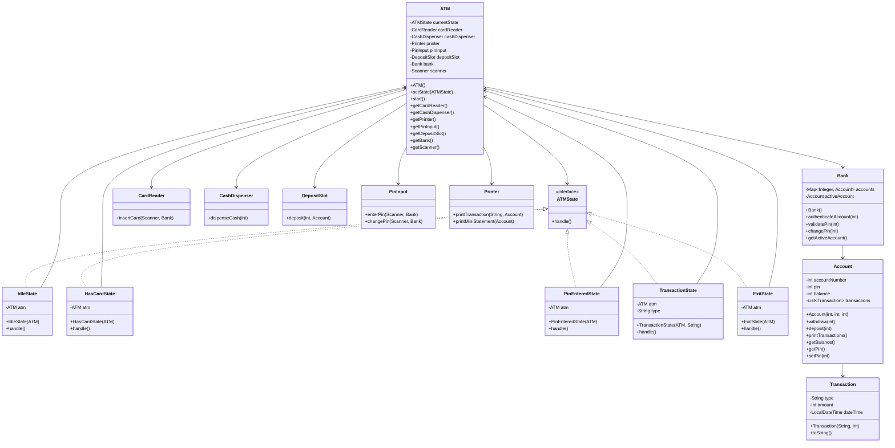
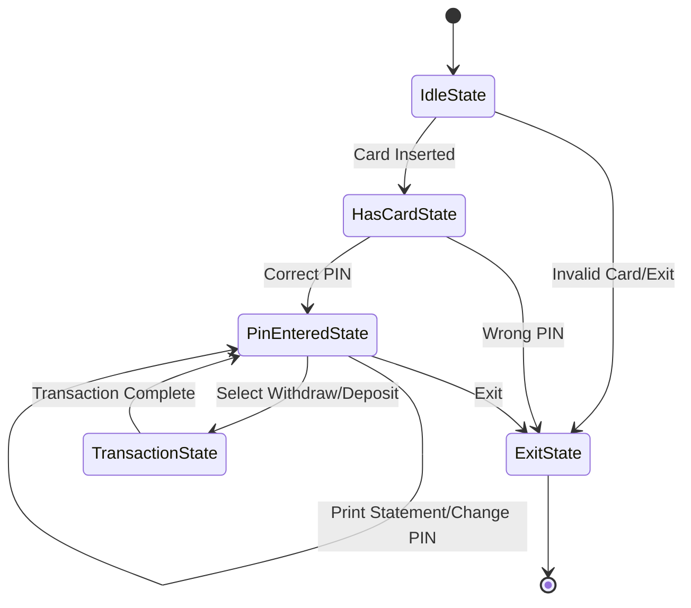
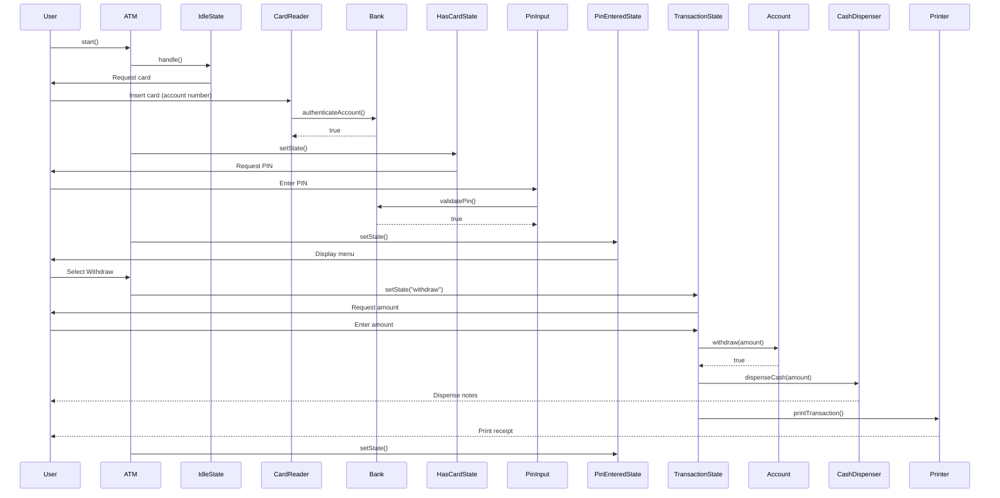

# ATM System

A comprehensive ATM (Automated Teller Machine) simulation system implemented in Java, demonstrating object-oriented design principles, state pattern, and multi-package architecture.

## Overview

This ATM system simulates real-world ATM operations including card authentication, PIN validation, cash withdrawal, cash deposit, mini statement printing, and PIN change functionality. The system is built using the State design pattern to manage different ATM states and transitions.

## Features

- **Card Authentication**: Validate account numbers against the bank database
- **PIN Verification**: Secure PIN-based authentication
- **Cash Withdrawal**: Withdraw money in multiples of 100 (dispenses 500, 200, and 100 notes)
- **Cash Deposit**: Deposit money into the account
- **Mini Statement**: Print transaction history
- **PIN Change**: Update account PIN
- **Transaction Receipts**: Print receipts for all transactions
- **State Management**: Seamless state transitions throughout the ATM workflow

## Architecture

The system follows a modular architecture with three main packages:

1. **atm**: Core ATM logic and state management
2. **bank**: Banking operations and account management
3. **components**: Hardware component simulations (card reader, cash dispenser, etc.)


## Project Structure

```
├── Main.java
├── atm/
│   ├── ATM.java
│   ├── ATMState.java
│   ├── IdleState.java
│   ├── HasCardState.java
│   ├── PinEnteredState.java
│   ├── TransactionState.java
│   └── ExitState.java
├── bank/
│   ├── Account.java
│   ├── Bank.java
│   └── Transaction.java
└── components/
    ├── CardReader.java
    ├── CashDispenser.java
    ├── DepositSlot.java
    ├── PinInput.java
    └── Printer.java
```

## UML Diagrams

### Class Diagram



### State Transition Diagram



### Sequence Diagram - Withdrawal Flow



## Installation

### Prerequisites

- Java Development Kit (JDK) 11 or higher
- Any Java IDE (IntelliJ IDEA, Eclipse, VS Code) or command line

### Steps

1. Clone or download the project files

2. Ensure the directory structure matches the package declarations:
   ```
   src/
   ├── Main.java
   ├── atm/
   ├── bank/
   └── components/
   ```

3. Compile the project:
   ```bash
   javac Main.java atm/*.java bank/*.java components/*.java
   ```

4. Run the application:
   ```bash
   java Main
   ```

## Usage

### Demo Accounts

The system comes with two pre-configured accounts:

| Account Number | PIN  | Balance |
|---------------|------|---------|
| 12345         | 1111 | 5000    |
| 67890         | 2222 | 10000   |

### Operations

1. **Start the ATM**
   - Run the Main class
   - Enter an account number when prompted

2. **Enter PIN**
   - Input the corresponding PIN for authentication

3. **Select Operation**
   - Option 1: Withdraw cash (multiples of 100 only)
   - Option 2: Deposit cash
   - Option 3: Print mini statement
   - Option 4: Change PIN
   - Option 5: Exit

4. **Complete Transaction**
   - Follow on-screen prompts
   - Receipt will be printed for transactions
   - Return to menu or exit

## Example Walkthrough

```
ATM is idle. Please insert your card.
Enter account number: 12345

Card inserted. Please enter your PIN.
Enter PIN: 1111

Select Option: 
1. Withdraw Cash
2. Deposit Cash
3. Print Mini Statement
4. Change PIN
5. Exit
1

Enter amount to withdraw: 1500
Dispensing cash: 1500
2 x 500 notes
2 x 200 notes
1 x 100 notes
---- Transaction Receipt ----
Withdrawn: 1500
Balance: 3500
-----------------------------

Select Option: 
1. Withdraw Cash
2. Deposit Cash
3. Print Mini Statement
4. Change PIN
5. Exit
5

Thank you for using the ATM. Goodbye!
```

## Future Enhancements

- **Multiple Currency Support**: Handle different denominations and currencies
- **Transaction Limits**: Daily withdrawal and deposit limits
- **Account Types**: Savings, Checking, Credit accounts
- **Network Banking**: Connect to actual banking APIs
- **Card Technology**: Chip and PIN, contactless payments
- **Receipt Options**: Email or SMS receipts
- **Multi-language Support**: Internationalization
- **Security Features**: Account locking after failed attempts, encryption
- **Advanced Statements**: Date range filtering, detailed transaction reports
- **Transfer Operations**: Account-to-account transfers
- **Bill Payments**: Utility bill payment functionality
- **GUI Interface**: Graphical user interface for better user experience
- **Logging System**: Comprehensive audit trail and logging
- **Error Recovery**: Handle edge cases and system failures gracefully

## Technical Notes

### Constraints

- Withdrawal amounts must be multiples of 100
- PIN must be numeric
- Account numbers are integers
- System uses console-based I/O

### Error Handling

- Invalid card numbers result in session termination
- Incorrect PIN attempts end the session (single attempt allowed)
- Insufficient balance prevents withdrawal
- Invalid menu choices re-display the menu

## Contributing

To extend this system:

1. Add new states by implementing `ATMState` interface
2. Create new components in the `components` package
3. Extend `Account` class for new account types
4. Add transaction types in `Transaction` class

## License

This is an educational project demonstrating design patterns and OOP principles.

---

**Note**: This is a simulation system for educational purposes. It does not connect to real banking systems or handle actual currency.
