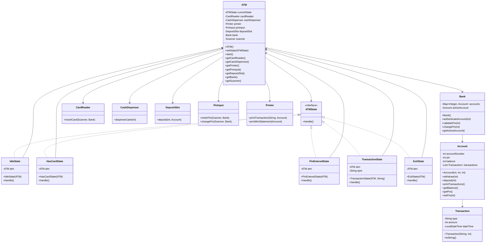

# ATM System

A comprehensive ATM (Automated Teller Machine) simulation system implemented in Java, demonstrating object-oriented design principles, state pattern, and multi-package architecture.

## Overview

This ATM system simulates real-world ATM operations including card authentication, PIN validation, cash withdrawal, cash deposit, mini statement printing, and PIN change functionality. The system is built using the State design pattern to manage different ATM states and transitions.

## Features

- **Card Authentication**: Validate account numbers against the bank database
- **PIN Verification**: Secure PIN-based authentication
- **Cash Withdrawal**: Withdraw money in multiples of 100 (dispenses 500, 200, and 100 notes)
- **Cash Deposit**: Deposit money into the account
- **Mini Statement**: Print transaction history
- **PIN Change**: Update account PIN
- **Transaction Receipts**: Print receipts for all transactions
- **State Management**: Seamless state transitions throughout the ATM workflow


## Project Structure

```
├── Main.java
├── atm/
│   ├── ATM.java
│   ├── ATMState.java
│   ├── IdleState.java
│   ├── HasCardState.java
│   ├── PinEnteredState.java
│   ├── TransactionState.java
│   └── ExitState.java
├── bank/
│   ├── Account.java
│   ├── Bank.java
│   └── Transaction.java
└── components/
    ├── CardReader.java
    ├── CashDispenser.java
    ├── DepositSlot.java
    ├── PinInput.java
    └── Printer.java
```

## UML Diagrams

### Class Diagram



### State Transition Diagram


### Demo Accounts

The system comes with two pre-configured accounts:

| Account Number | PIN  | Balance |
|---------------|------|---------|
| 12345         | 1111 | 5000    |
| 67890         | 2222 | 10000   |

### Operations

1. **Start the ATM**
   - Run the Main class
   - Enter an account number when prompted

2. **Enter PIN**
   - Input the corresponding PIN for authentication

3. **Select Operation**
   - Option 1: Withdraw cash (multiples of 100 only)
   - Option 2: Deposit cash
   - Option 3: Print mini statement
   - Option 4: Change PIN
   - Option 5: Exit

4. **Complete Transaction**
   - Follow on-screen prompts
   - Receipt will be printed for transactions
   - Return to menu or exit

## Example Walkthrough

```
ATM is idle. Please insert your card.
Enter account number: 12345

Card inserted. Please enter your PIN.
Enter PIN: 1111

Select Option: 
1. Withdraw Cash
2. Deposit Cash
3. Print Mini Statement
4. Change PIN
5. Exit
1

Enter amount to withdraw: 1500
Dispensing cash: 1500
2 x 500 notes
2 x 200 notes
1 x 100 notes
---- Transaction Receipt ----
Withdrawn: 1500
Balance: 3500
-----------------------------

Select Option: 
1. Withdraw Cash
2. Deposit Cash
3. Print Mini Statement
4. Change PIN
5. Exit
5

Thank you for using the ATM. Goodbye!
```


### Constraints

- Withdrawal amounts must be multiples of 100
- PIN must be numeric
- Account numbers are integers
- System uses console-based I/O

### Error Handling

- Invalid card numbers result in session termination
- Incorrect PIN attempts end the session (single attempt allowed)
- Insufficient balance prevents withdrawal
- Invalid menu choices re-display the menu

